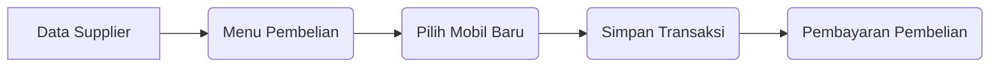
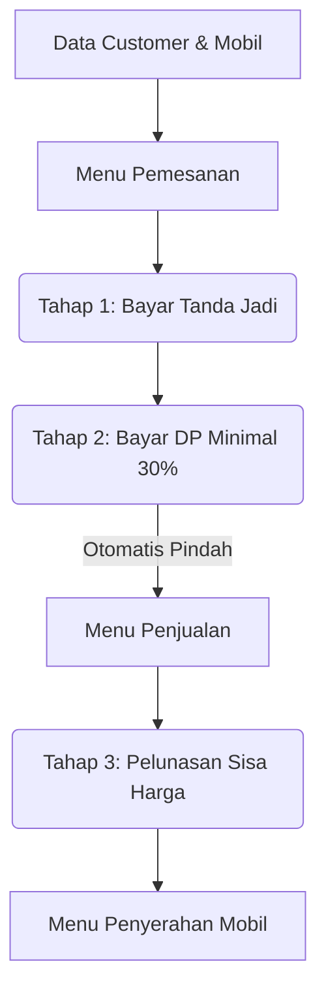

# Panduan Alur Sistem POS Showroom Mobil

Sistem ini dibagi menjadi dua alur utama: **Showroom membeli mobil dari luar (Kulakan)** dan **Showroom menjual mobil ke pelanggan**.

Berikut adalah penjelasan lengkap dari setiap menu agar Anda tidak bingung.

---

## 1. Data Master (Data Dasar)
Menu-menu ini adalah fondasi. Sebelum bisa melakukan transaksi beli atau jual, data di sini harus diisi terlebih dahulu.
* **Customer**: Data orang-orang yang membeli mobil dari Anda.
* **Supplier**: Data orang atau perusahaan tempat Anda membeli stok mobil.
* **Mobil**: Katalog/inventaris mobil Anda. Data di sini akan bertambah stoknya jika Anda beli dari Supplier, dan berkurang jika lunas terjual ke Customer.

---

## 2. Alur Pembelian (Showroom Membeli Mobil)
Ini adalah alur ketika **Showroom Anda membeli mobil dari pihak luar (Supplier)** untuk dijadikan stok.

* **Pembelian**: Anda mencatat mobil apa yang dibeli dari Supplier mana. Saat disimpan, status mobil menjadi milik showroom.
* **Pembayaran Pembelian**: Tempat Anda mencatat bukti bahwa showroom sudah mentransfer uang ke Supplier.

---

## 3. Alur Penjualan (Showroom Menjual Mobil)
Ini adalah alur ketika **Pelanggan membeli mobil dari Showroom Anda**. Proses ini sengaja dibuat bertahap (Pemesanan -> DP -> Lunas) karena jualan mobil jarang yang langsung bayar tunai di tempat.

* **Pemesanan**: Customer datang, memilih mobil, dan melakukan *Booking* (Tanda Jadi). Kemudian berlanjut membayar Uang Muka (DP). *Catatan: Tombol "Bayar" ada di dalam menu Pemesanan ini untuk tahap Tanda Jadi & DP.*
* **Penjualan**: Setelah DP masuk, pesanan tadi **otomatis pindah ke menu Penjualan**. Di menu inilah Anda memantau mana yang sudah lunas dan belum. Pelunasan dilakukan dari menu ini.
* **Pembayaran Penjualan**: Ini hanya menu **Laporan/Riwayat** untuk melihat daftar uang (Tanda Jadi, DP, Pelunasan) yang sudah berhasil ditransfer/dibayar oleh semua Customer.
* **Penyerahan Mobil**: Setelah status di menu Penjualan = "Lunas", Anda bisa menyerahkan mobil ke Customer (Kirim/Ambil di tempat). Saat diserahkan, stok mobil resmi berkurang.

---

## 4. Pelaporan
* **Laporan**: Menampilkan ringkasan pendapatan, pengeluaran, dan untung-rugi showroom dalam periode waktu tertentu. Anda bisa mencetak PDF-nya dari sini.

> [!TIP]
> **Singkatnya:** Jika Anda mengeluarkan uang, mainnya di `Supplier -> Pembelian`. Jika Anda menerima uang, mainnya di `Customer -> Pemesanan -> Penjualan -> Penyerahan`.
